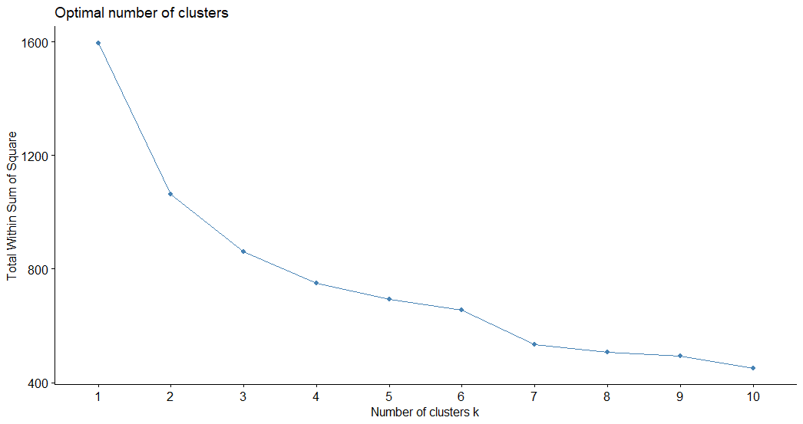
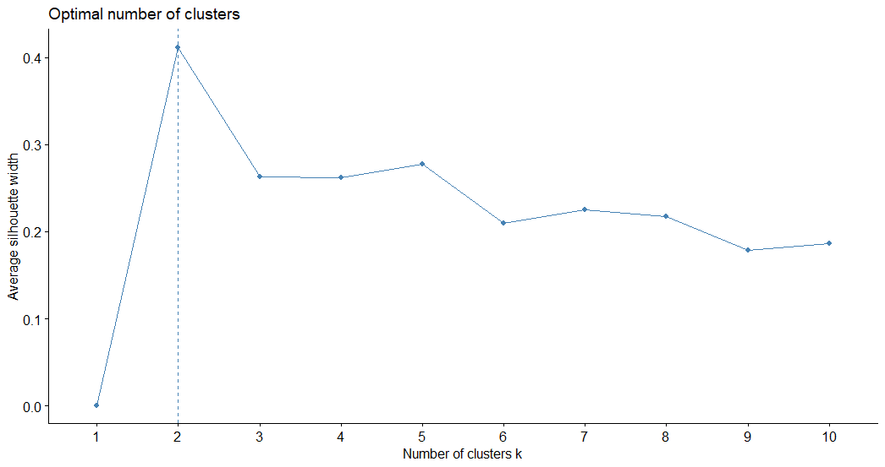
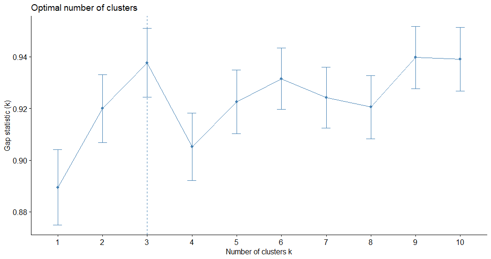
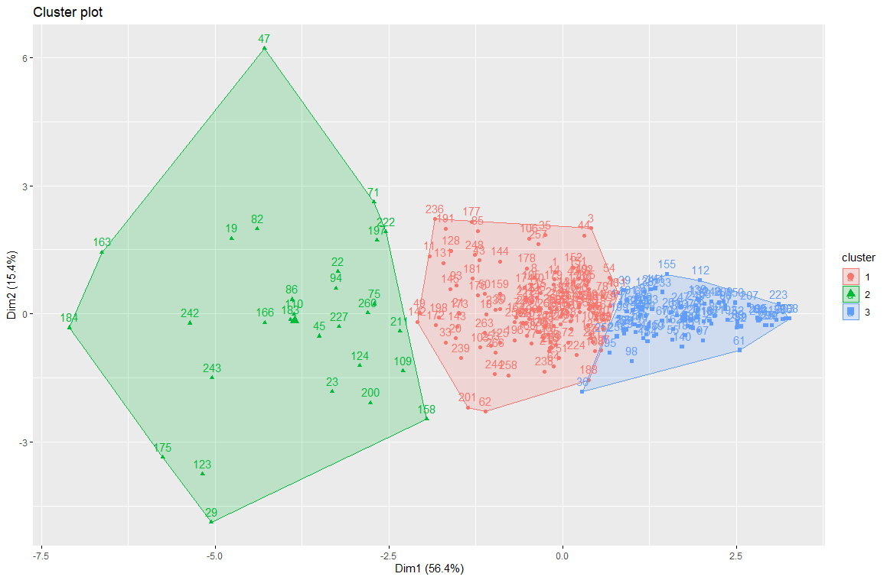

# Cluster COVID-19 in Jakarta
### K-Mean Clustering Methods
##### Data Sources: https://corona.jakarta.go.id/id 
###### Data taken in 10 November 2020 (10:00 GMT +7)

##### Cluster Analysis in R
1. Install Packages & Calling the Library
```R
install.packages("tidyverse") #data manipulation
install.packages("cluster") #clustering algorithm
install.packages("factoextra") #clustering algorithm & data visualization

library(tidyverse)
library(cluster)
library(factoextra)
```

2. Import data set
```R
dataset <- read.csv(file.choose())
```

3. Check and delete missing value
```R
dataset <- na.omit(dataset)
summary(dataset) 
```

4. Choice value of X
```R
dataCovid <- data.frame(dataset[2:7])
head(dataCovid)
```

5. Make a standardization data
```R
dataCovidNew <- scale(dataCovid)
head(dataCovidNew)
```

6. Find K Optimum
* Elbow Methods
```R
fviz_nbclust(dataCovidNew, kmeans, method = "wss")
```

* Silhouette Methods
```R
fviz_nbclust(dataCovidNew, kmeans, method = "silhouette")
```

* Gap Statistic Methods
```R
set.seed(484) #Randomize data and lock the data
gap_stat <-clusGap(dataCovidNew, FUN=kmeans, nstart=25, K.max=10, B=150)
fviz_gap_stat(gap_stat)
```

\
`K-Optimum = 3`

7. K Means Cluster
```R
set.seed(4848)
covidCluster <- kmeans(dataCovidNew, 3)
print(covidCluster)
```

8. Visualization of Clustering
```R
fviz_cluster(covidCluster, data = dataCovidNew)
```


9. Adding Jakarta Maps **[!Coming Soon]**

#### Conclusion
##### There are 3 clusters (1st cluster is the good place, 2nd medium, 3rd bad)
> 1st Cluster: 146 sub-districts \
> 2nd Cluster: 29 sub-districts \
> 3rd Cluster: 92 sub-districts 

Stay at home and stay healthy, everyone!